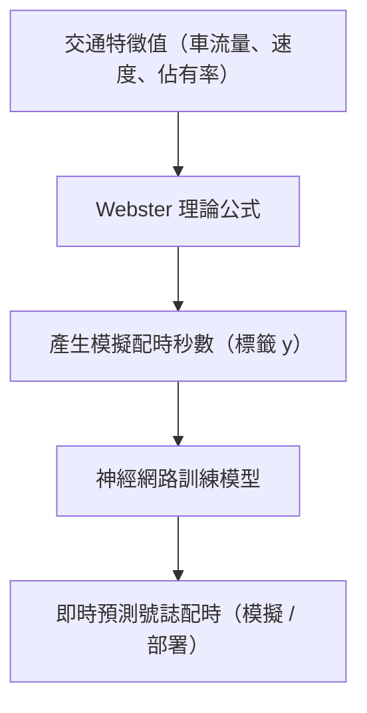

# 非線性神經網路在缺乏 y 值時如何定義標籤：結合 Webster 理論的弱監督學習策略

在智慧交通號誌控制的研究中，真實的紅綠燈配時資料（如即時號誌秒數）通常無法直接取得。
為了解決「缺乏標籤（y 值）」的問題，我們採用了以下策略：

## 📌 問題背景：缺乏實際標籤資料

- 目前政府並未公開即時交通號誌的紅綠燈配時秒數。
- 實地蒐集配時資料的成本高、難度大。
- 機器學習模型（尤其是監督式學習）需依賴 y 值進行訓練。

---

## ✅ 解決方案：結合 Webster 理論進行標籤生成

我們採用交通工程中經典的 **Webster 配時法**，依據車流量、飽和流率、週期長度等變數，**計算出每組交通特徵對應的合理配時秒數**，作為模型訓練的 y 值。
這種方式稱為：

- **Weak Supervision（弱監督學習）**
- **Synthetic Labeling（合成標籤）**
- **Knowledge-Guided ML（知識導向機器學習）**

這個模型的核心策略是讓非線性神經網路模型適應（或說學習）Webster 配時法所代表的交通邏輯，再結合「特徵值比重」與「懲罰」的設計，
進一步微調並優化配時預測結果。這樣的設計是一種結合理論與數據的「知識導向學習」策略。

這樣的設計包含三個層面：

✅ Webster 理論適應：模型學習 Webster 配時邏輯，建立交通控制基礎認知。
⚖️ 特徵比重調整：賦予不同特徵（如大型車比重、飽和度）的重要性權重，強化模型感知能力。
❗ 懲罰項機制：對於如「長等待時間」或「不平衡配時」的預測結果給予損失懲罰，讓模型趨向更合理與公平的配時策略。

---

## 🔄 模型學習流程

---

## ✨ 分階段學習策略

### 第一階段：模仿 Websters 理論（建立交通邏輯基礎）

- 模型先模仿 Webster 理論產生的秒數結果。
- 相當於學習一個基礎的交通控制邏輯，避免亂學習。

### 第二階段：模型自我優化與延伸（處理更複雜情境）

引入動態或異常情境，模型開始學習如何「超越 Webster」：

- 高峰 / 離峰不對稱車流
- 突發事件（事故、擁堵）
- 時序變動（時間序列趨勢）
- 增量學習自動調整配時策略

---

## 🧠 理論合理性分析

| 評估面向           | 說明                                                                                   |
| ------------------ | -------------------------------------------------------------------------------------- |
| **理論依據**       | Webster 是交通工程中經典公式，能根據車流參數計算合理配時，具備專業與實務上的理論支撐。 |
| **標籤品質**       | 雖非實測數據，但具備交通邏輯，可視為有品質的弱標籤，有助於模型建立初步交通邏輯。       |
| **模型特性對應**   | 神經網路擅長處理非線性問題，能補足 Webster 線性公式的限制，學習更複雜的特徵交互關係。  |
| **擴充性與未來性** | 未來如取得真實號誌資料，可透過增量學習或轉移學習來調整模型，進一步提升準確性。         |

---

## 🏛 學術與實務應用背景

### ✔ 研究與論文中常見做法

- 使用 **Webster、HCM 等理論** 產生模擬配時資料。
- 搭配 **模擬器（如 SUMO）** 做資料擴增與策略測試。
- 使用這些資料進行 **初期模型建構與演算法開發**。

### ✔ 政府或研究機構實驗系統

- 在尚未與真實交通控制器串接前，會用理論數據模擬控制結果。
- 進行測試與概念驗證（Proof of Concept, POC）。

### ✔ 工程團隊研發原型階段

- 使用合成數據進行初步模型訓練。
- 測試整體系統流程與概念可行性。
- 待模型穩定後再對接實務資料。

---

## 🧰 專業術語說明（可用於報告與口試）

| 名稱                          | 定義                                                               |
| ----------------------------- | ------------------------------------------------------------------ |
| **Weak Supervision**          | 使用不準確或間接的標籤來訓練模型，如根據理論公式自動產生的標籤。   |
| **Synthetic / Pseudo Labels** | 標籤由演算法或規則產生，而非人工標註。                             |
| **Knowledge-Guided ML**       | 融入專家知識（如交通理論）來輔助機器學習模型建立與優化。           |
| **Simulation-Aided ML**       | 使用模擬資料訓練模型，適用於資料難取得或尚未部署系統時的訓練階段。 |

---

## ✅ 結論

透過 **Webster 理論結合神經網路模型**，在缺乏真實標籤的情況下，建立具備交通邏輯與學習能力的配時預測模型，是一種 **合理且被廣泛接受的做法**。

這樣的方式在智慧交通、號誌控制、AI 模型研究等領域屬於：

- 知識導向的實作策略
- 可延伸至真實場域應用
- 符合學術發表與實務落地的雙重需求

---

如果你需要我根據這段內容製作簡報稿、圖表或加入文獻佐證，也可以幫你補上。是否需要？
