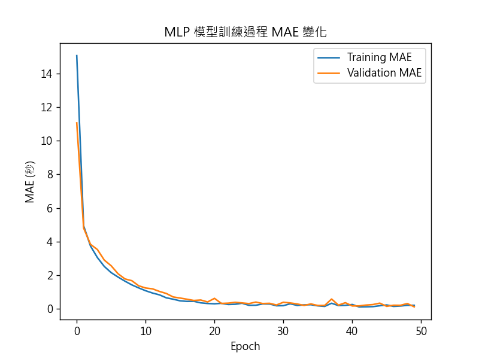

# MAE(Mean Absolute Error) 平均絕對誤差

MAE（Mean Absolute Error）就是「平均絕對誤差」，如果目標值是「綠燈秒數」，那 MAE 就直接代表預測結果平均偏差多少秒。

比如說：

MAE = 2 → 平均預測誤差是 2 秒
MAE = 0.5 → 平均誤差只有半秒

這種數字很直觀，很容易跟實務情況對應，能直接說「模型預測的綠燈秒數平均誤差是幾秒」

## mae (訓練集的 MAE)

如果訓練 MAE 持續下降，但驗證 MAE 開始上升，通常代表模型開始過擬合，

## val_mae (驗證集的 MAE)

代表模型對「沒看過的資料」的預測誤差，直接反映模型的泛化能力，也就是實際應用時的表現。

## 📊 MAE 例子

- 訓練 MAE 和驗證 MAE 都下降 → 模型正常學習。
  
- 訓練 MAE 很低，驗證 MAE 很高 → 過擬合。
- 訓練 MAE 和驗證 MAE 都很高 → 欠擬合或資料問題。

驗證 MAE > 訓練 MAE 是正常的，因為驗證資料是模型沒看過的，誤差通常會比訓練資料大一些。這是預期中的現象，不一定表示「沒學好」。
如果驗證 MAE 比訓練 MAE 大很多，而且差距隨訓練輪數持續擴大，代表模型可能過擬合：**在訓練資料學得很好，但泛化到新資料能力差**。
如果驗證 MAE 跟訓練 MAE 都很高，表示模型學習不足（欠擬合），可能是模型太簡單或訓練時間不夠。

## 📈 1. 初始階段（Epoch 1 ～ 5）

```
Epoch 1: loss=890.02, mae=23.33 → val_loss=47.05, val_mae=4.70
Epoch 2: loss=41.92,  mae=4.32  → val_loss=23.13, val_mae=3.32
Epoch 3: loss=24.96,  mae=3.36  → val_loss=17.67, val_mae=2.85
Epoch 4: loss=17.19,  mae=2.60  → val_loss=12.68, val_mae=2.20
Epoch 5: loss=12.56,  mae=2.08  → val_loss=8.51,  val_mae=1.71
```

### 🔍 分析：

- **loss 和 val_loss 快速下降**：模型在快速學習，從一開始誤差超過 20 秒迅速下降到 2 秒以內。
- 代表特徵是有意義的，模型學得動，且數據的模式明確。

---

## 🧠 2. 模型穩定學習期（Epoch 6 ～ 13）

```
Epoch 6: loss=8.59,   mae=1.66 → val_mae=1.48
Epoch 7: loss=6.44,   mae=1.43 → val_mae=1.22
Epoch 8: loss=4.85,   mae=1.22 → val_mae=1.23
Epoch 9: loss=3.63,   mae=1.06 → val_mae=0.89
Epoch10: loss=2.54,   mae=0.87 → val_mae=0.71
Epoch11: loss=1.68,   mae=0.74 → val_mae=0.55
Epoch12: loss=1.02,   mae=0.60 → val_mae=0.50
Epoch13: loss=0.72,   mae=0.51 → val_mae=0.54
```

### 🔍 分析：

- **MAE 已經進入 0.5 秒等級**，代表預測非常精準。
- 有些 epoch（如第 13 輪）略有反彈，是正常波動。
- 這段期間訓練和驗證都同步下降，**沒有過擬合現象**，非常健康。

---

## ⚠️ 3. 穩定中帶震盪（Epoch 14 ～ 26）

```
Epoch14: loss=0.49,   mae=0.41 → val_mae=0.43
Epoch15: loss=0.46,   mae=0.42 → val_mae=0.35
Epoch16: loss=0.38,   mae=0.37 → val_mae=0.48 ← ↑
Epoch17: loss=0.44,   mae=0.41 → val_mae=0.29
Epoch18: loss=0.26,   mae=0.31 → val_mae=0.32
Epoch20: loss=0.21,   mae=0.29 → val_mae=0.26
Epoch21: loss=0.22,   mae=0.28 → val_mae=0.19 ✅
Epoch22: loss=0.17,   mae=0.26 → val_mae=0.27 ← ↑
Epoch23: loss=0.22,   mae=0.29 → val_mae=0.43 ← ↑
Epoch24: loss=0.19,   mae=0.29 → val_mae=0.25
Epoch25: loss=0.14,   mae=0.25 → val_mae=0.31
Epoch26: loss=0.28,   mae=0.33 → val_mae=0.32
```

### 🔍 分析：

- 有些 epoch 中 val_mae 有**震盪上升（例如 0.19 → 0.27 → 0.43）**，顯示模型已經學完大多數資訊，開始在驗證資料上**些微過擬合**。
- 但整體 **MAE 已控制在 0.25 ～ 0.5 秒之間**，對交通號誌預測來說這是非常好的結果。
- 最低驗證 MAE 是 **0.19 秒（Epoch 21）**，可考慮作為最佳模型。

---

## ✅ 總結評價

| 項目                   | 評價                                                          |
| ---------------------- | ------------------------------------------------------------- |
| **資料品質與特徵設計** | 👍 表現良好，特徵如 `Volume_`、`Speed_` 等很有用。            |
| **模型收斂速度**       | 🚀 快速下降，顯示模型容易學習。                               |
| **預測精準度**         | ✅ 驗證 MAE 最好約 0.19 秒，平均也在 0.2 ～ 0.4 之間。        |
| **過擬合**             | ⚠️ 約在 20 輪後略有震盪，但不嚴重。可加早停或正規化。         |
| **可再優化空間**       | 嘗試增加 Dropout、加 L2 正規化、或 Grid Search 調整學習率等。 |
